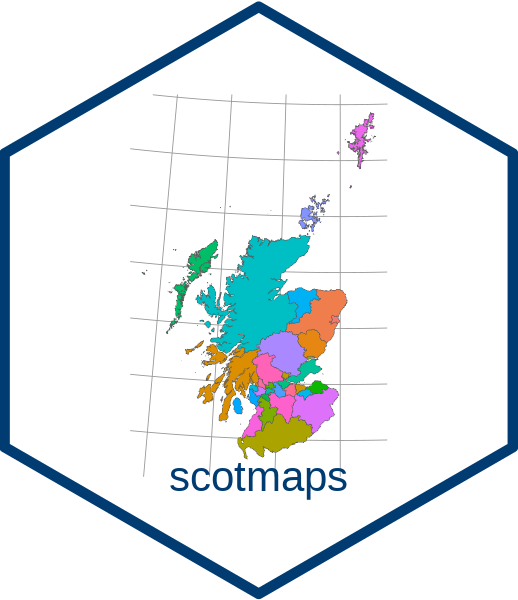
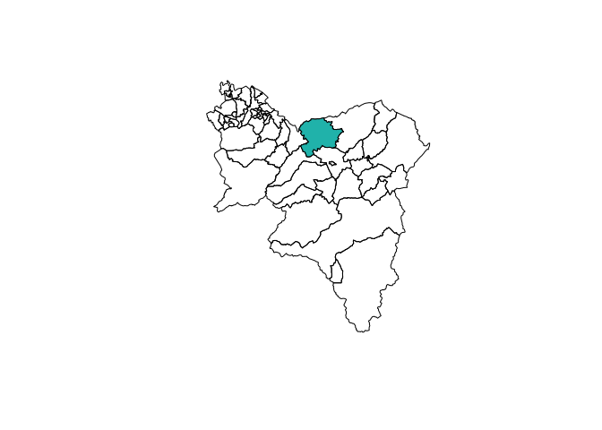
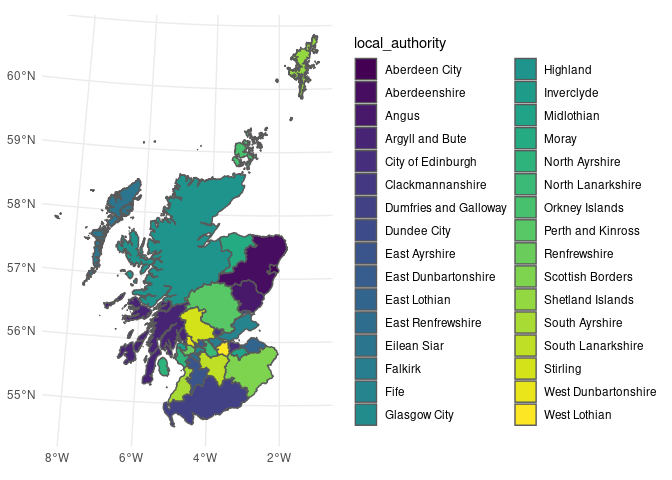

<!-- README.md is generated from README.Rmd. Please edit that file and re-knit-->

# scotmaps 

### Version 0.0.0.1

<!-- badges: start -->

[](https://github.com/bcgov/repomountie/blob/8b2ebdc9756819625a56f7a426c29f99b777ab1d/doc/state-badges.md)
[](https://opensource.org/licenses/Apache-2.0)
[](https://github.com/fozy81/scotmaps/actions)
[](https://cran.r-project.org/package=scotmaps)
[](https://CRAN.R-project.org/package=scotmaps)
<!-- badges: end -->

## Overview

An [R](http://r-project.org) package of spatial map layers for Scotland.
This package is a fork of the Province of British Columbia
[`bcmaps`](https://github.com/bcgov/bcmaps) package.

## Features

Provides access to various spatial layers of Scotland, such as
administrative boundaries, natural resource management boundaries etc.
All layers use the [Open Government
Licence](http://www.nationalarchives.gov.uk/doc/open-government-licence/version/3/)
and made available in the
[27700](https://spatialreference.org/ref/epsg/27700) projection, which
is the Scottish Government standard.

Layers are assessed directly from the
[spatialdata.gov.scot](https://www.spatialdata.gov.scot/) catalogue. See
each layer’s individual help file for more detail.

## Installation

To install the development version of the `scotmaps` package, you need
to install the `devtools` package then the `scotmaps` package.

``` r
install.packages("devtools")
devtools::install_github("fozy81/scotmaps")
```

## Usage

To view all the layers that are available, run the `available_layers()`
function:

``` r
available_layers()
```

Layers are accessible by a shortcut function by the same name as the
object. Then you can use the data as you would any Simple Features
([`sf`](https://r-spatial.github.io/sf/)) object. The first time you run
a layer function, you will be prompted for permission to download that
layer to your hard drive. Subsequently, that layer is stored locally for
quick access. For example:

``` r
library(sf)

ma <- marine_areas()
plot(st_geometry(ma), col = "lightblue")
```

<!-- -->

### Simple Features objects

All layers are returned as [`sf` spatial
objects](https://cran.r-project.org/package=sf):

``` r
library(scotmaps)
library(sf)

# Load and plot the community councils in South Lanarkshire
cc <- community_councils()
sl <- cc[cc$local_authority == "South Lanarkshire", ]
plot(st_geometry(sl))

# Next, extract and plot the Carluke community council area
carluke <- cc[cc$cc_name == "Carluke", ]
plot(st_geometry(carluke), col = "lightseagreen", add = TRUE)
```

<!-- -->

### Respect My *Local* Authority

A handy layer for creating maps for display is the `local_authorities`
layer, accessible with the function by the same name. This example also
illustrates using the popular [ggplot2](https://ggplot2.tidyverse.org/)
package to plot maps in R using `geom_sf`:

``` r
library(ggplot2)
ggplot() + 
  geom_sf(data = local_authorities(), mapping = aes(fill = local_authority)) + 
  scale_fill_viridis_d(name = "local_authority") +
  theme_minimal()
```

<!-- -->

### Updating layers

When you first call a layer function scotmaps will remind you when that
layer was last updated in your cache with a message. For a number of
reasons, it might be necessary to get a fresh layer in your scotmaps
cache. The easiest way to update is to use the `force` argument:

``` r
cc <- community_councils(force = TRUE)
```

Another option is to actively manage your cache by deleting the old
layer and calling the function again:

``` r
delete_cache('community_councils')
cc <- community_councils()
```

### Vignettes

After installing the package you can view vignettes by typing
`browseVignettes("scotmaps")` in your R session.

### Utility Functions

The package also contains a couple of handy utility functions:

1.  `fix_geo_problems()` for fixing invalid topologies in `sf` or
    `Spatial` objects such as orphaned holes and self-intersections
2.  `self_union()` Union a `SpatialPolygons*` object with itself to
    remove overlaps, while retaining attributes

## Getting Help or Reporting an Issue

To report bugs/issues/feature requests, please file an
[issue](https://github.com/fozy81/scotmaps/issues/).

## How to Contribute

Pull requests of new scotmaps layers are welcome. If you would like to
contribute to the package, please see our
[CONTRIBUTING](https://github.com/fozy81/scotmaps/blob/master/CONTRIBUTING.md)
guidelines.

Please note that this project is released with a [Contributor Code of
Conduct](https://github.com/fozy81/scotmaps/blob/master/CODE_OF_CONDUCT.md).
By participating in this project you agree to abide by its terms.

## Source Data

The source datasets used in this package come from various sources under
open licences, including
[spatialdata.gov.scot](https://www.spatialdata.gov.scot/). See the
`data-raw` folder for details on each source dataset.

## Licence

    # Modifications copyright (C) 2020 Tim Foster
    # Copyright 2017 Province of British Columbia
    # 
    # Licensed under the Apache License, Version 2.0 (the "License");
    # you may not use this file except in compliance with the License.
    # You may obtain a copy of the License at
    # 
    # http://www.apache.org/licenses/LICENSE-2.0
    # 
    # Unless required by applicable law or agreed to in writing, software distributed under the License is distributed on an "AS IS" BASIS,
    # WITHOUT WARRANTIES OR CONDITIONS OF ANY KIND, either express or implied.
    # See the License for the specific language governing permissions and limitations under the License.
