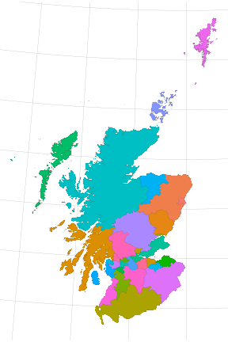
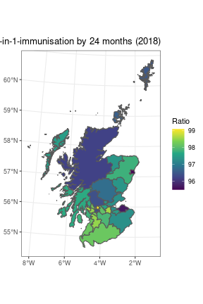
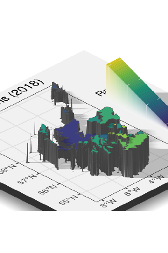
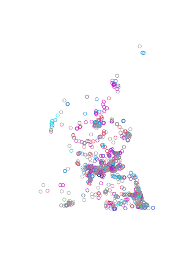
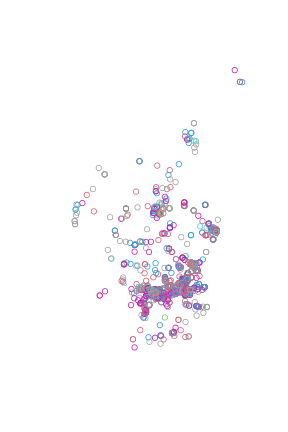
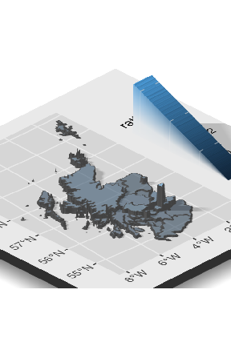

<!-- scotmaps.Rmd is generated from scotmaps.Rmd.orig Please edit that file and re-knit knitr::knit("vignettes/scotmaps.Rmd.orig", output = "vignettes/longexample.Rmd") -->


## Introduction

Use `scotmaps` to download map layers from [www.spatialdata.gov.scot](https://www.spatialdata.gov.scot) with single line of R code. Here we provide a few quick examples of how the package can be used.

## Usage

See all the layers available:


```r
library(scotmaps)
available_layers()
```


### Download Layers

Either use `get_layer("name of your layer")` or `name_of_layer()`. For example you can down the marine areas using either of these functions:


```r
ma <- get_layer("marine_areas")
# or...
ma <- marine_areas()
```

The first time you run a layer function, you will be prompted for permission to download that layer to your hard drive.

If you have already downloaded a layer you can see if it's cached by using `cached_layers()`.

### Start Mapping!

To plot a map we'll use the `ggplot2` library. This package helps to format and present our data layers.


```r
library(ggplot2)

la <- local_authorities()

p <- ggplot(la) +
  geom_sf(data = la, aes(fill = local_authority), size = 0.05) +
  guides(fill = FALSE) +
  scale_fill_discrete() +
  theme_void() +
  theme(panel.grid.major = element_line(colour = "grey60", size = 0.1))

p
```



The `geom_st` recognises the simple feature or `sf` map downloaded layer and plots at a spatial object in the correct map projection.

### Map *all* the Stats

Let's download data from [statistics.gov.scot](https://statistics.gov.scot/home) and display it on a map.

```r
# install.packages("devtools")
# devtools::install_github("datasciencescotland/opendatascot")
library(opendatascot)
library(tidyverse)

# Immunisation data
immune <- ods_dataset("6-in-1-immunisation", geography = "la")
immune <- immune %>% filter(vaccinationUptake == "vaccinated-by-24-months",
                     measureType == "ratio",
                     refPeriod == 2018)

immune <- immune %>% mutate(value = as.numeric(value))

# Join to local authority spatial layer
la_immune <- inner_join(la, immune, by = c("code" = "refArea"))

p2 <- la_immune %>%
 ggplot() +
  geom_sf(aes(fill = value)) +
  scale_fill_viridis_c("Ratio") +
  theme_bw() +
  labs(title="6-in-1-immunisation by 24 months (2018)")

p2
```



Looks good but what about in 3D? Don't worry, `rayshader` package has your back.


```r
# devtools::install_github("tylermorganwall/rayshader")
library(rayshader)
plot_gg(p2, multicore = TRUE)
render_camera(zoom = 0.4, theta = -45, phi = 30)
Sys.sleep(0.2)
render_snapshot()
```



```r
rgl::rgl.close()
```


### Map your own stats

Let's calculate bicycle parking capacity per person for each local authority in Scotland.

First, download the [bicycle parking](https://wiki.openstreetmap.org/wiki/Tag:amenity%3Dbicycle_parking) data from OpenStreetMap. OpenStreetMap is open data, licensed under the [Open Data Commons Open Database License (ODbL)](https://www.openstreetmap.org/copyright) copyright OpenStreetMap contributors.


```r
# install.packages("osmdata")
library(osmdata)
scot <- getbb ("scotland", format_out = "polygon")
bicycles <- opq(scot[[3]][3]) %>%
  add_osm_feature(key = "amenity",
                  value = "bicycle_parking",
                  value_exact = TRUE) %>%
  osmdata_sf()

# Use osm point data
points <- bicycles$osm_points
# Tidy up missing capacity values
points$capacity <- as.numeric(points$capacity)
# Default if capacity not recorded
points$capacity[is.na(points$capacity)] <- median(points$capacity, na.rm = T)
# Convert to same crs as default scotmaps
points <- st_transform(points, crs = 27700)
plot(st_geometry(points), col = points$capacity)
```



Our OpenStreetMap query returned a wider area than Scotland, so let's join points to associated Scottish local authority areas.


```r
points <- st_join(points, la, join = st_within)
# Cropped points with a local authority
plot(st_geometry(points[!is.na(points$local_authority), ]), col = points$capacity)
```



Now we can sum capacity available in each authority.

```r
capacity <- points %>%
  group_by(code) %>%
  summarise(total = sum(capacity)) %>%
  st_set_geometry(NULL) # remove the geometry column
#> `summarise()` ungrouping output (override with `.groups` argument)
```

Next, download census population data using `opendatascot` package and calculate
bicycle parking capacity per person.


```r
# devtools::install_github("datasciencescotland/opendatascot")
library(opendatascot)
population <- ods_dataset("census-population-2001", geography = "la")
population <- population %>%
  filter(measureType == "count",
         age == "all",
         gender == "all")

total_points <- inner_join(capacity, population, by = c("code" = "refArea"))

# Calculate the pop / bicycle ratio
total_points$value <- as.numeric(total_points$value)
total_points <- total_points %>%  mutate(ratio = total / value)

# Join to authority areas
la_totals <- inner_join(la, total_points, by = c("code" = "code"))
```

Plot data on map:


```r
# devtools::install_github("tylermorganwall/rayshader")
library(rayshader)
p3 <- ggplot(la_totals) +
  geom_sf(aes(fill = ratio), alpha = 0.5) +
  scale_colour_viridis_c()

plot_gg(p3, multicore = TRUE)
render_camera(zoom = 0.4, theta = -45, phi = 30)
Sys.sleep(0.2)
render_snapshot()
```



```r
rgl::rgl.close()

```

### Availability of Public Bicycle Parking Capacity

Alternatively, we could present the data as a league table:


```r
total <- st_set_geometry(la_totals, NULL)
total <- mutate(total,  "per_100" = ratio * 100)

# make table
arrange(total, desc(per_100)) %>%
  mutate('No.' = seq_along(local_authority)) %>%
  select(No.,
         "Local Authority" = local_authority,
         "Capacity per 100 people" = per_100) %>%
  knitr::kable()
```


| No.|Local Authority       | Capacity per 100 people|
|---:|:---------------------|-----------------------:|
|   1|City of Edinburgh     |               3.2452566|
|   2|Dundee City           |               1.1251999|
|   3|Fife                  |               1.0079301|
|   4|Glasgow City          |               0.9571373|
|   5|Midlothian            |               0.9241299|
|   6|East Lothian          |               0.8458396|
|   7|Aberdeen City         |               0.7594579|
|   8|Stirling              |               0.7539554|
|   9|Highland              |               0.7318801|
|  10|West Lothian          |               0.6659778|
|  11|Orkney Islands        |               0.6443232|
|  12|Perth and Kinross     |               0.4616559|
|  13|Eilean Siar           |               0.4075164|
|  14|North Lanarkshire     |               0.3821632|
|  15|South Lanarkshire     |               0.3431321|
|  16|West Dunbartonshire   |               0.3127075|
|  17|Argyll and Bute       |               0.2978994|
|  18|East Renfrewshire     |               0.2541680|
|  19|East Dunbartonshire   |               0.2392764|
|  20|Falkirk               |               0.2383068|
|  21|South Ayrshire        |               0.2212370|
|  22|Dumfries and Galloway |               0.2206206|
|  23|Scottish Borders      |               0.2098085|
|  24|Renfrewshire          |               0.2024678|
|  25|Inverclyde            |               0.1686401|
|  26|Shetland Islands      |               0.1637257|
|  27|Aberdeenshire         |               0.1617659|
|  28|Moray                 |               0.1230734|
|  29|Clackmannanshire      |               0.1206398|
|  30|North Ayrshire        |               0.0868816|
|  31|Angus                 |               0.0571956|
|  32|East Ayrshire         |               0.0382584|
