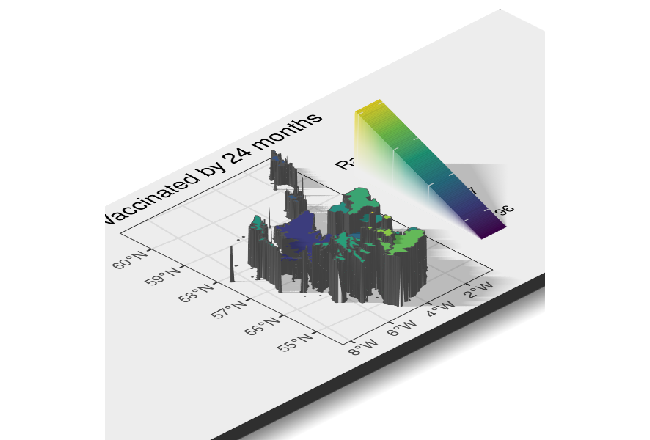
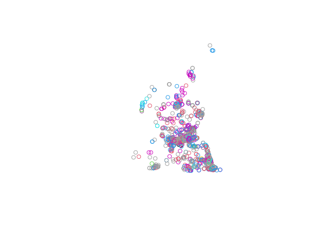
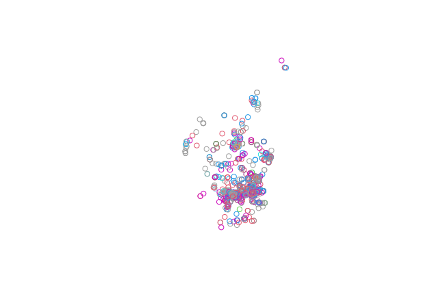
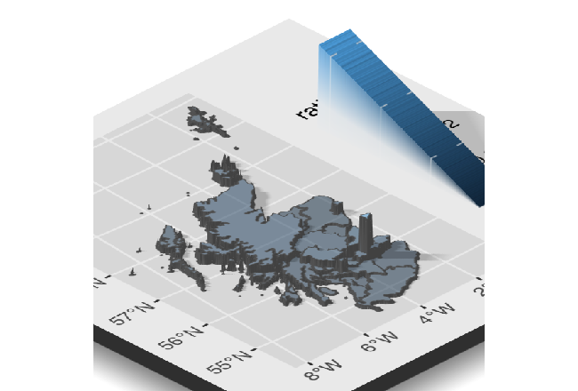

```{r, include = FALSE}
knitr::opts_chunk$set(
  collapse = TRUE,
  comment = "#>",
  fig.width=4,
  fig.height=6
)
```


## Introduction

Use `scotmaps` to download map layers from [www.spatialdata.gov.scot](www.spatialdata.gov.scot) with single line of R code. 

## Usage

See all the layers available: 

```{r available-layers}
library(scotmaps)
available_layers()
```


### Download Layers

Either use `get_layer("name of your later")` or `name_of_layer()`. For example you can down the marine areas using either of these functions:

```{r, eval=FALSE}
ma <- get_layer("marine_areas")
# or...
ma <- marine_areas()

```

The first time you run try to access a layer map files, you will be prompted for permission to download that layer to your hard drive.
  
If you have already downloaded a layer you can see if it's cached by using `cached_layers()`

## Start Maping!

To plot a map we'll use the `ggplot2` library. This package helps to format and present our data layers. 

```{r}
library(ggplot2)

la <- local_authorities()

p <- ggplot(la) +
  geom_sf(data = la, aes(fill = local_authority), size = 0.05) +
  guides(fill = FALSE) +
  scale_fill_discrete() +
  theme_void() +
  theme(panel.grid.major = element_line(colour = "grey60", size = 0.1))

p

```

The `geom_st` recognises the simple feature or `sf` map downloaded layer and plots at a spatial object in the correct map projection. 

## Map *all* the Stats

Let's download data from [statistics.gov.scot](https://statistics.gov.scot/home) and display it on a map. 
```{r, echo=FALSE}
# install.packages("devtools")
# devtools::install_github("datasciencescotland/opendatascot")
library(opendatascot)
library(tidyverse)

# Immunisation data
immune <- ods_dataset("6-in-1-immunisation", geography = "la")

immune <- immune %>% filter(vaccinationUptake == "vaccinated-by-24-months", 
                     measureType == "ratio",
                     refPeriod == 2018)

immune <- immune %>% mutate(value = as.numeric(value))

la_immune <- inner_join(la, immune, by = c("code" = "refArea"))
p2 <- la_immune %>% 
 ggplot() +
  geom_sf(aes(fill = value)) +
   scale_fill_viridis_c("Ratio") +
   theme_bw() +
  labs(title="Vaccinated by 24 months") 

p2

```

Looks good but what about in 3D? Don't worry, `rayshader` package has your back.

```{r, eval=FALSE}
# devtools::install_github("tylermorganwall/rayshader")
library(rayshader)

plot_gg(p2, width = 6, height=2.7)
render_camera(zoom = 0.4, theta = -45, phi = 30)
Sys.sleep(0.2)
render_snapshot()
rgl::rgl.close()

```

<br>

## Map your own stats

Let's calculate bicycle parking capacity per person for each local authority in Scotland. 

First, download the bicycle parking data from OpenStreetMap.

```{r, eval=FALSE}
# install.packages("osmdata")
library(osmdata)
scot <- getbb ("scotland", format_out = "polygon")
bicycles <- opq(scot[[8]][3]) %>% 
  add_osm_feature(key = "amenity", value = "bicycle_parking", value_exact = TRUE) %>% 
  osmdata_sf()

# Use osm point data 
points <- bicycles$osm_points
# Tidy up missing capacity values
points$capacity <- as.numeric(points$capacity)
# Default if capacity not recorded
points$capacity[is.na(points$capacity)] <- median(points$capacity, na.rm = T) 
# Convert to same crs as default scotmaps
points <- st_transform(points, crs = 27700)
plot(st_geometry(points), col = points$capacity)
```

<br>

Join to local authority areas 

```{r, eval=FALSE}
points <- st_join(point, la, join = st_within)
# Cropped points with a local authority
plot(st_geometry(points[!is.na(points$local_authority), ]), col = points$capacity)
```

<br>

Sum capacity available in each authority 
```{r, eval=FALSE}

capacity <- points %>% group_by(code) %>% 
  summarise(total = sum(capacity)) %>%
  st_set_geometry(NULL) # remove the geometry column 

head(capacity, 5)
```

Next, get census population data from opendatascot and calculate bicycle parking capacity per person.

```{r, eval=FALSE}
population <- ods_dataset("census-population-2001", geography = "la")
population <- population %>%
  filter(measureType == "count",
         age == "all",
         gender == "all")

total_points <- inner_join(capacity, population, by = c("code" = "refArea"))

# Calculate the pop / bicycle ratio
total_points$value <- as.numeric(total_points$value)
total_points <- total_points %>%  mutate(ratio = total / value)

# Join to authority areas
la_totals <- inner_join(la, total_points, by = c("code" = "code"))

```

Plot data on map

```{r, eval=FALSE}
p3 <- ggplot(la_totals) +
  geom_sf(aes(fill = ratio), alpha = 0.5) +
  scale_colour_viridis_c() 

plot_gg(p3, multicore = TRUE) 
render_camera(zoom = 0.4, theta = -45, phi = 30)
Sys.sleep(0.2)
render_snapshot()
rgl::rgl.close()


```

<br>

But maybe it's better presented as a league table...3D maps not always the best option.

```{r, eval=FALSE}
total <- st_set_geometry(la_totals, NULL)
total <- mutate(total,  "per_100" = ratio * 100)

# make table
arrange(total, desc(per_100)) %>% 
select("Local Authority" = local_authority,
       "Capacity per 100 people" = per_100) %>% 
knitr::kable()

```

|Local Authority       | Capacity per 100 people|
|:---------------------|-----------------------:|
|City of Edinburgh     |               3.2443650|
|Dundee City           |               1.1251999|
|Fife                  |               1.0079301|
|Glasgow City          |               0.9564451|
|Midlothian            |               0.9241299|
|East Lothian          |               0.7825682|
|Aberdeen City         |               0.7594579|
|Stirling              |               0.7539554|
|Highland              |               0.7318801|
|West Lothian          |               0.6659778|
|Orkney Islands        |               0.6443232|
|Perth and Kinross     |               0.4616559|
|Eilean Siar           |               0.4075164|
|North Lanarkshire     |               0.3821632|
|South Lanarkshire     |               0.3431321|
|West Dunbartonshire   |               0.3127075|
|Argyll and Bute       |               0.2978994|
|East Renfrewshire     |               0.2541680|
|East Dunbartonshire   |               0.2392764|
|Falkirk               |               0.2383068|
|South Ayrshire        |               0.2212370|
|Dumfries and Galloway |               0.2206206|
|Scottish Borders      |               0.2098085|
|Renfrewshire          |               0.2024678|
|Inverclyde            |               0.1686401|
|Shetland Islands      |               0.1637257|
|Aberdeenshire         |               0.1617659|
|Moray                 |               0.1230734|
|Clackmannanshire      |               0.1206398|
|North Ayrshire        |               0.0868816|
|Angus                 |               0.0571956|
|East Ayrshire         |               0.0382584|


